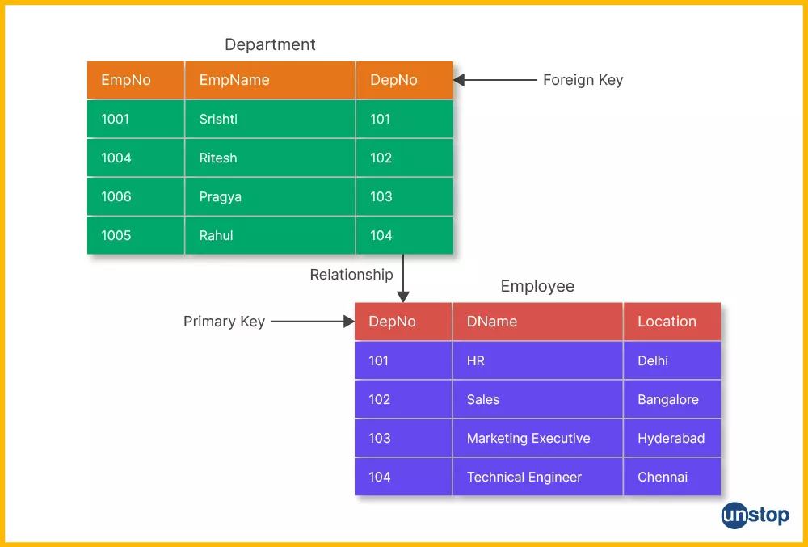
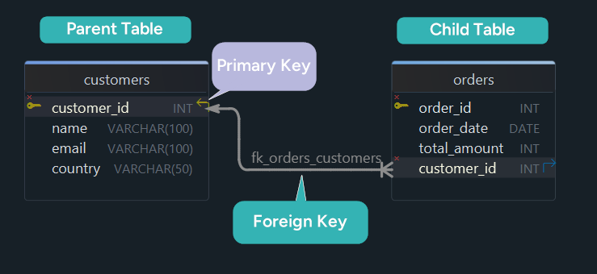
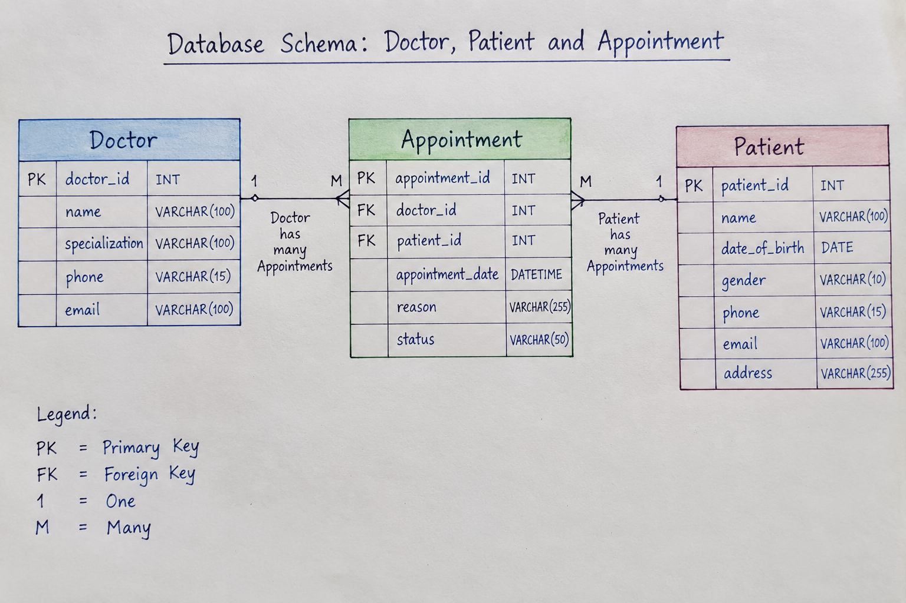

# Foreign key 
A foreign jey is a column or combinations of columns in one table that references a candidate key, normally a primary  key or unique key in another table. Main purpose is to maintain referential integrity between related tables.

Visual representation:


---
If we try to insert the a query(101 bahubali 110) then it will give error bcoz department 10 doesn't exist.
## Parent table and child table 
Parent table: The table containing the referenced key is called parent table.In above example department table is an parent table or owner table.Parnt key doesn't have foreign key

Child table: table containing the foreign key is called child table. 

### Example:
Customers and orders 


Doctor,Patient and Appointments


## Advantages of foreign key
1. Maintains referential integrty: A foreign key ensures that a value in the child table must correspond to an existing value in the parent table.
2. prevents invalid data: It stops users from inserting unrelated or invalid id's into the child table. 
3. It maintains relationships b/w two tables.
4. Prevents orphan records : An orphan record is a child record whose parent no longer exist. 
5. It controls delete operations.
6. It controls update operations.
7. It makes database design more reliable.

Syntax:
```
create table parenttable(id int primary key)
create table childtable(id int primary kye,parentid int,foreign key(parentid) references parenttable(id))
```

Example:
```
create table department18(deptid int primary key,deptname varchar(20));

create table employee18(empid int primary key,empname varchar(20),deptid int,foreign key(deptid) references department18(deptid));

insert into department18 values(1,"hr"),(2,"it"),(3,"finance");

insert into employee18 values(101,"deepika",1),(102,"rashmika",2),(103,"thapaji",3);

insert into employee18 values(104,"kanak",5);
ERROR 1452 (23000): Cannot add or update a child row: a foreign key constraint fails (`batch18`.`employee18`, CONSTRAINT `employee18_ibfk_1` FOREIGN KEY (`deptid`) REFERENCES `department18` (`deptid`))
The above query gives error bcoz department id 5 is not available in department18 table.

insert into employee18 values(104,"kanak",1);
We can have duplicate foreign keys bcoz foreign key doesn't mean value must be unique.

insert into employee18(empid,empname) values(105,"kalu");
Foreign key can contain null value by default bcoz null is not equal to invalid dept it means the employee currently has no depatment value

```

## Foreign key Vs primary key
|Foreign key | Primary key|
|---|---|
|referenes a key in another table|uniquely identify rows|
|it can contain null bydefault|primary can contain null|
|multiple foreign key per table|One primary key per table|
|It allows duplicate bydefault|It prevents duplicate entries|
|It establish relationship|It identify any entity|

## naming a foreign key 
when we create a foreign key we can give the foreign key constraint a name, this helps us to identify the relationship b/w two tables easily.
```
constraint constraintname foreign key(column name ) references parentable(parent column) 
```
```
alter table tablename drop foreign key keyname;
```

# On delete in MYSQL
```
delete from department18 where deptid=1;
ERROR 1451 (23000): Cannot delete or update a parent row: a foreign key constraint fails (`batch18`.`employee18`, CONSTRAINT `employee18_ibfk_1` FOREIGN KEY (`deptid`) REFERENCES `department18` (`deptid`))
```
In the above query mysql will not allow deletion bcoz employee 101 is still referencing department 1. Foreign key allows individual deletion like 
```
mysql> delete from employee18 where empid=102;
Query OK, 1 row affected (0.02 sec)

mysql> delete from department18 where deptid=2;
Query OK, 1 row affected (0.02 sec)

Here no reference is b/w tables so it allowed deletion
```
Without on delete means do not allow deletion of the parent row if child rows are referring to it.
```
On delete syntax
create table name(.......,foreign key(childcolumn) references parenttable(parentcolumn) on delete action)
```

for mysql the actions are :
1. cascade 
2. restrict
3. no action
4. set null 

## On delete cascade
If the parent record is deleted automatically delete the related child records. 
```
create table department183(deptid int primary key,deptname varchar(20));

create table employee183(empid int primary key,empname varchar(50),deptid int,foreign key(deptid) references department183(deptid) on delete cascade);

select * from department183;
+--------+----------+
| deptid | deptname |
+--------+----------+
|      1 | cs       |
+--------+----------+
1 row in set (0.00 sec)

select * from employee183;
+-------+----------+--------+
| empid | empname  | deptid |
+-------+----------+--------+
|   101 | deepika  |      1 |
|   102 | raskmika |      1 |
+-------+----------+--------+
2 rows in set (0.00 sec)

delete from department183 where deptid=1;

mysql> select * from department183;
Empty set (0.00 sec)

mysql> select * from employee183;
Empty set (0.00 sec)
```
## On delete restrict
On delete restrict means do not allow the parent record to be deleted if child records are using it

## On delete no action

## On delete set null


## Difference b/w set null and cascade 

# On update 
```
mysql> select * from department18;
+--------+----------+
| deptid | deptname |
+--------+----------+
|      1 | hr       |
|      3 | finance  |
+--------+----------+
2 rows in set (0.04 sec)

mysql> select * from employee18;
+-------+---------+--------+
| empid | empname | deptid |
+-------+---------+--------+
|   101 | deepika |      1 |
|   103 | thapaji |      3 |
|   105 | kalu    |   NULL |
+-------+---------+--------+
3 rows in set (0.03 sec)

update department18 set deptid=10 where deptid=1;
ERROR 1451 (23000): Cannot delete or update a parent row: a foreign key constraint fails (`batch18`.`employee18`, CONSTRAINT `employee18_ibfk_1` FOREIGN KEY (`deptid`) REFERENCES `department18` (`deptid`))
```
Note: If we change deptid and child records referring to it then by default it doesn't allow to update, 
```
update department18 set deptname="hr_IT" where deptid=1;
Query OK, 1 row affected (0.02 sec)
Rows matched: 1  Changed: 1  Warnings: 0
```
## On update cascade
If the referrenced key in the parent table changes automatically update the corresponding foreign key values in the child table.
```
create table department185(deptid int primary key, deptname varchar(50));

create table employee185(empid int primary key,empname varchar(20),deptid int, foreign key(deptid) references department185(deptid) on update cascade);

insert into department185 values(1,"IT"),(2,"HR"),(3,"Finance");

insert into employee185 values(125,"Deepika",1),(126,"Rashmika",2),(3,"katappa",3);

update department185 set deptid=5 where deptid=1;

mysql> select * from department185;
+--------+----------+
| deptid | deptname |
+--------+----------+
|      2 | HR       |
|      3 | Finance  |
|      5 | IT       |
+--------+----------+
3 rows in set (0.00 sec)

mysql> select * from employee185;
+-------+----------+--------+
| empid | empname  | deptid |
+-------+----------+--------+
|     3 | katappa  |      3 |
|   125 | Deepika  |      5 |
|   126 | Rashmika |      2 |
+-------+----------+--------+
3 rows in set (0.00 sec)
```
In the above example mysql automatically changes the child rows. 

## On update set null
When the parent key changes set the corresponding child foreign key values to null.
```
Make the same structured table with on update set null

Now if we update the parent table deptid so in child records it will automatically set null
```
H.w:
1. How to add foreign key constraints if table is already created
2. How to drop foreign key constraint

## Combining On delete and On update
```
create table department187(deptid int primary key, deptname varchar(50));

create table employee187(empid int primary key,empname varchar(20),deptid int, foreign key(deptid) references department187(deptid) on update cascade on delete cascade);

```

# Types of relationships
In a relational database a relationship describes how rows in one table are connected to rows in another table
1. One to One relationship:
It means one row in table A is associated with at-most one row in table B and vice-versa.
Ex: One employee will have one employee card, one person will have one password, One user will have one profile
```
Employee and employee card

create table employee200(empid int primary key,empname varchar(25));

create table employeecard200(cardid int primary key,empid int unique,card_no varchar(20), foreign key(empid) references employee200(empid));

insert into employee200 values(101,"deepika"),(102,"rashmika");

insert into employeecard200 values(1,101,"CARD111");

insert into employeecard200 values(2,101,"CARD111");
ERROR 1062 (23000): Duplicate entry '101' for key 'employeecard200.empid'


```

## One to many relationships (1:n)
In one to many relationship one row in the parent table can be associated with multiple rows in the child table but each child row belongs to one parent. 
The foreign key is placed on the many side.  
Example: one department has many employees, One teacher can have multiple students

## Many to one relationship (n:1)
many to one is similar to one to many but it is viewed from the opposite direction.  
Example: Many student one course .

## many to many relationship
It means one row in table A can be associated with many rows in table B, and one row in table B can be associated with many rows in table A.  
```
Suppose we have student table and course table.
One student can be enrollled in 2-3 courses and same way courses can also have many student so when we try to insert we cannot insert cause primary key should be unique , but we have to enter it , so we will use 3rd table.
```
Note: We cannot directly create many-to-many relationships using 2 tables bcoz in that case we have to repeat the student information therefore we need third table.  
That third table is called junction-table or bridge-table or mapping-table or associated-table
```
Student
    |
Student_course
    |
Course

Another examples are : employee and project, 
```
H.W. : Can we have composite foreign key

## self referencing foreign key
It is a foreign key where a column in a table refers to the primary key or unique key of the same table. In  other words, a table creates a relationship with itself. 
```
create table selfemployee(empid int primary key,empname varchar(20) not null,managerid int, foreign key(managerid) references selfemployee(empid));

insert into selfemployee values(101,"Deepika",null);

insert into selfemployee values(102,"Thapa",110);
ERROR 1452 (23000): Cannot add or update a child row: a foreign key constraint fails (`batch18`.`selfemployee`, CONSTRAINT `selfemployee_ibfk_1` FOREIGN KEY (`managerid`) REFERENCES `selfemployee` (`empid`))

insert into selfemployee values(105,"Hello",105);

select * from selfemployee;
+-------+---------+-----------+
| empid | empname | managerid |
+-------+---------+-----------+
|   101 | Deepika |      NULL |
|   102 | thapa   |       101 |
|   105 | Hello   |       105 |
+-------+---------+-----------+
3 rows in set (0.00 sec)
```


